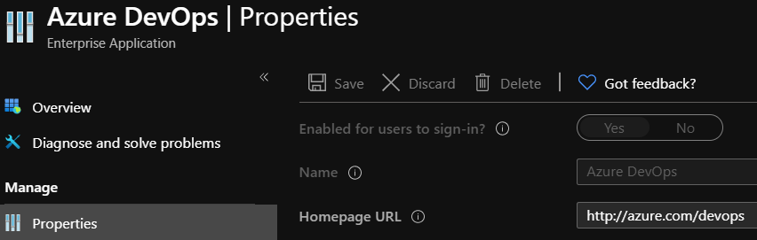
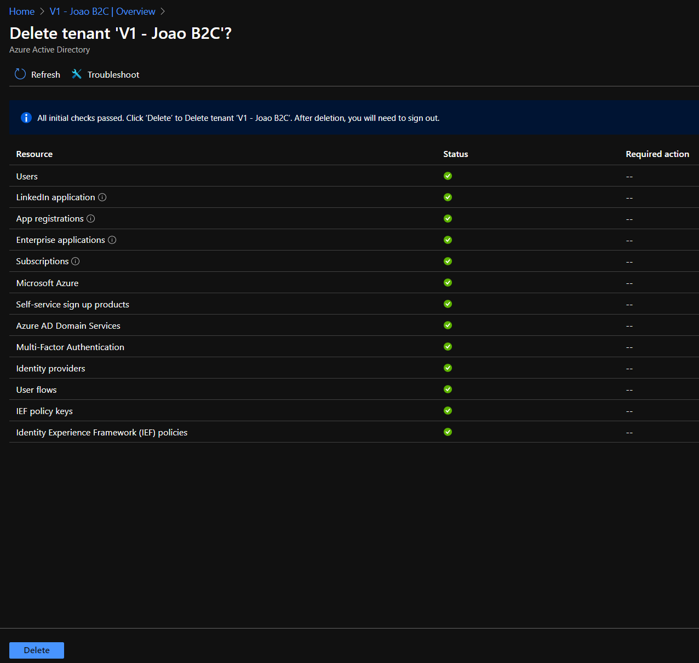

In the past months I had to delete a couple of Azure B2C tenants. And while the experience in the Azure Portal is straight forward enough I was always getting stuck in clearing the Azure AD Enterprise Applications.

In particular the Enterprise App Registration for Azure DevOps. Even as a Global Admin the delete button is always disabled. Since the Portal does not allow this operation the solution is to use PowerShell for this task.



## Getting Started

The below steps go through the process of deleting an Enterprise Application using PowerShell.

Windows PowerShell 5.1 with the AzureAD module was used.

## 1 - Connect to Azure AD

```PowerShell
$TenantId = "xxxxx-xxxxx-xxxxx-xxxxx-xxxxx"
Connect-AzureAD -TenantId $TenantId
```

## 2 - Create New User

```PowerShell
$NewUserEmail = "NewUser@xxxxx.onmicrosoft.com"
$NewUserName = "NewUser"

$PasswordProfile = New-Object -TypeName Microsoft.Open.AzureAD.Model.PasswordProfile
$PasswordProfile.Password = "XXXXX"
New-AzureADUser -DisplayName $NewUserName -PasswordProfile $PasswordProfile -UserPrincipalName $NewUserEmail -AccountEnabled $true -MailNickName $NewUserName
```

## 3 - Set New User as Global Admin

```PowerShell
$roleMember = Get-AzureADUser -ObjectId $NewUserEmail
$role = Get-AzureADDirectoryRole | Where-Object {$_.displayName -eq 'Company Administrator'}
Add-AzureADDirectoryRoleMember -ObjectId $role.ObjectId -RefObjectId $roleMember.ObjectId
```

## 4 - Log in with new User

```PowerShell
Connect-AzureAD -TenantId $TenantId -AccountId $NewUserEmail
```

## 5 - Get Enterprise App Object Id

```PowerShell
$AzDevOps = Get-AzureADServicePrincipal | Where-Object {$_.displayName -eq 'Azure DevOps'}
```

## 6 - Remove Enterprise App

```PowerShell
Remove-AzureADServicePrincipal -ObjectId $AzDevOps.ObjectId
```

### 6.1 -  If just removing the Azure DevOps enterprise app is not enough, run this

### 6.1.1 - Some errors will appear: "Specified App Principal ID is Microsoft Internal." it's safe to ignore them

```PowerShell
Get-AzureADServicePrincipal | Select-Object -ExpandProperty ObjectId | ForEach-Object {
     Remove-AzureADServicePrincipal -ObjectId $_
}
```

## 7 - Now go the Azure Portal -> Azure AD -> Delete NewUser -> Delete tenant

Now you should see everything ticked green and ready to delete.



**Hope this helped! Reach out to me on twitter if you have any questions!**
