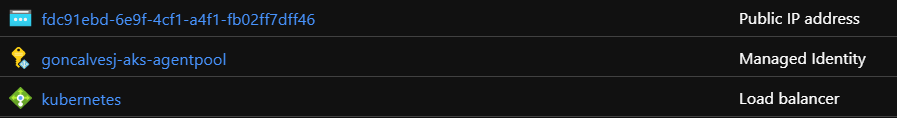

One of the things I was meaning to try out for some time was Azure Managed Identities in AKS clusters.

I was always a fan of Managed Identities, I started using them in Azure App Services as soon as they were released in preview and became convinced straight away.

Azure Managed Identities to me is something should be used in projects as much as possible, mostly because:

- Increases security of your applications
- No more sensitive information in source control and configuration files

I already had an AKS cluster up an running for my own projects, so the only thing that was missing was allowing the pods to use Azure Managed Identities to connect to Azure AD and get tokens to be used connecting to other Azure services like Azure Key Vault.

## Create an AKS cluster

The first step is to create an AKS cluster with managed identities enabled.

The Azure portal allows for this today and it's a straight forward process.

An alternative is to run a terraform script that takes care of this. Script here:

**<https://github.com/goncalvesj/iac-templates/blob/master/TerraformTemplates/Azure.AKS/resources.tf>**

Once the cluster is created there is 1 new resource type of Managed Identity in the resource group.



## Adding AAD Pod Identity to the cluster

For this I looked at the steps outlined here:

**<https://github.com/Azure/aad-pod-identity>**

I did the above with a small difference, I used the existing Managed Identity and didn't create a new one.

So my steps were the following (I did them in Azure Cloud Shell):

```bash
# Deploy using Helm 3
helm repo add aad-pod-identity https://raw.githubusercontent.com/Azure/aad-pod-identity/master/charts
helm install aad-pod-identity aad-pod-identity/aad-pod-identity

# Set up env vars
export IDENTITY_NAME="goncalvesj-aks-agentpool"
export SUBSCRIPTION_ID="xxxxx"
export RESOURCE_GROUP="xxxxx"

export IDENTITY_CLIENT_ID="$(az identity show -g $RESOURCE_GROUP -n $IDENTITY_NAME --subscription $SUBSCRIPTION_ID --query clientId -otsv)"
export IDENTITY_RESOURCE_ID="$(az identity show -g $RESOURCE_GROUP -n $IDENTITY_NAME --subscription $SUBSCRIPTION_ID --query id -otsv)"

# Since the role assignent was created when the cluster was created
# we only have to get the role assignment id
# Look for the one where the principal name property is the same as the client id
az role assignment list -g $RESOURCE_GROUP

# Get the id and save as env var, should be similar to this
export IDENTITY_ASSIGNMENT_ID="/subscriptions/xxxxx/resourcegroups/xxxxx/providers/Microsoft.Authorization/roleAssignments/xxxxx"
```

## Deploy AzureIdentity & AzureIdentityBinding as defined in the github repo

```bash
cat <<EOF | kubectl apply -f -
apiVersion: "aadpodidentity.k8s.io/v1"
kind: AzureIdentity
metadata:
  name: $IDENTITY_NAME
spec:
  type: 0
  resourceID: $IDENTITY_RESOURCE_ID
  clientID: $IDENTITY_CLIENT_ID
EOF

cat <<EOF | kubectl apply -f -
apiVersion: "aadpodidentity.k8s.io/v1"
kind: AzureIdentityBinding
metadata:
  name: $IDENTITY_NAME-binding
spec:
  azureIdentity: $IDENTITY_NAME
  selector: $IDENTITY_NAME
EOF
```

## Testing

For testing I created a .NET Core Worker Service with the following code.

```CSharp
while (!stoppingToken.IsCancellationRequested)
{
    _logger.LogInformation("Worker running at: {time}", DateTimeOffset.Now);

    try
    {
        var secretClient = new SecretClient(
                            new Uri("https://xxxxx.vault.azure.net/"),
                            new DefaultAzureCredential());
        var secret = await secretClient.GetSecretAsync("Secret1", cancellationToken: stoppingToken);

        _logger.LogInformation($"KV Secret: {secret.Value.Value}");
    }
    catch (Exception e)
    {
        Console.WriteLine(e);
        _logger.LogError(e, "Error:");
        throw;
    }

    await Task.Delay(10000, stoppingToken);
}
```

## Deploy

Deployed it to Docker Hub and then to the AKS cluster as a single pod. Notice the **aadpodidbinding** label field, that is what will connect the pod to the managed identity.

```bash
cat << EOF | kubectl apply -f -
apiVersion: v1
kind: Pod
metadata:
  name: workerservice2
  labels:
    aadpodidbinding: $IDENTITY_NAME
spec:
  containers:
  - name: workerservice2
    image: goncalvesj/workerservice2:20200811134040
  nodeSelector:
    kubernetes.io/os: linux
EOF
```

If all went well you should be able to see the secret being printed to the container logs with:

```bash
kubectl logs workservice2 --follow
```

### Credits to everyone who built and works on the **<https://github.com/Azure/aad-pod-identity>** and made a guide so easy to follow

**Hope this helped! Reach out to me on twitter if you have any questions!**
